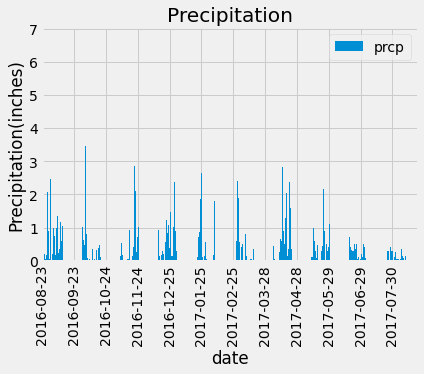
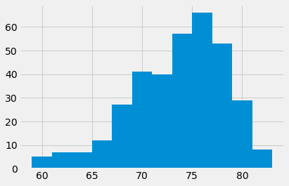

```python
%matplotlib inline
from matplotlib import style
style.use('fivethirtyeight')
import matplotlib.pyplot as plt
```


```python
import numpy as np
import pandas as pd
import datetime as dt
```

# Reflect Tables into SQLAlchemy ORM


```python
# Python SQL toolkit and Object Relational Mapper
import sqlalchemy
from sqlalchemy.ext.automap import automap_base
from sqlalchemy.inspection import inspect
from sqlalchemy.orm import Session
from sqlalchemy import create_engine, func
```


```python
# create engine to hawaii.sqlite
engine = create_engine("sqlite:///Resources/hawaii.sqlite")
Base = automap_base()
inspector = inspect(engine)
inspector.get_table_names()
```


    ['measurement', 'station']


```python
# reflect an existing database into a new model
# reflect the tables
Base.prepare(engine, reflect=True)


```


```python
# View all of the classes that automap found
Base.classes.keys()


```


    ['measurement', 'station']


```python
# Save references to each table
Station = Base.classes.station
Measurement = Base.classes.measurement

```


```python
# Create our session (link) from Python to the DB
session = Session(engine)
```

# Exploratory Precipitation Analysis


```python
# Find the most recent date in the data set.
Recent_Date_str = session.query(Measurement.date).order_by(Measurement.date.desc()).first()[0]
Recent_Date = dt.date.fromisoformat(Recent_Date_str)
Recent_Date


```


    datetime.date(2017, 8, 23)


```python
# Design a query to retrieve the last 12 months of precipitation data and plot the results. 
# Starting from the most recent data point in the database. 
# Calculate the date one year from the last date in data set.

Prev_Recent_Date = dt.date(Recent_Date.year-1,Recent_Date.month,Recent_Date.day)
Prev_Recent_Date
# Perform a query to retrieve the data and precipitation scores
data_prcp = session.query(Measurement.date,func.max(Measurement.prcp)).\
    filter(Measurement.date >= func.strftime("%Y-%m-%d",Prev_Recent_Date)).\
    group_by(Measurement.date).\
    order_by(Measurement.date).all()

# Save the query results as a Pandas DataFrame and set the index to the date column
data_frame = pd.DataFrame(data_prcp, columns=['date', 'prcp'])
data_frame.set_index('date', inplace=True)
# Sort the dataframe by date
data_frame.sort_index(inplace=True)

# Use Pandas Plotting with Matplotlib to plot the data
data_frame.plot.bar()
#plt.tight_layout()
plt.xticks(rotation = 90)
plt.title("Precipitation")
plt.ylabel("Precipitation(inches)")
plt.locator_params(axis='x',nbins=12)
plt.show()

```


    

    


```python
# Use Pandas to calcualte the summary statistics for the precipitation data
query_data = session.query(Measurement.date,Measurement.prcp).\
    filter(Measurement.date >= func.strftime("%Y-%m-%d",Prev_Recent_Date)).\
    order_by(Measurement.date).all()

prcp_data_frame = pd.DataFrame(query_data, columns=['date', 'prcp'])
prcp_data_frame.set_index('date', inplace=True)
prcp_data_frame
data_prcp_max = prcp_data_frame.groupby(["date"]).max()["prcp"] 
data_prcp_min = prcp_data_frame.groupby(["date"]).min()["prcp"] 
data_prcp_sum = prcp_data_frame.groupby(["date"]).sum()["prcp"] 
data_prcp_count = prcp_data_frame.groupby(["date"]).count()["prcp"] 

dict_data_prcp = {"Max": data_prcp_max
                 ,"Min":data_prcp_min
                 ,"Sum":data_prcp_sum
                 ,"Count":data_prcp_count 
                }

prcp_data_frame_summary = pd.DataFrame(dict_data_prcp)
prcp_data_frame_summary


```


<div>
<style scoped>
    .dataframe tbody tr th:only-of-type {
        vertical-align: middle;
    }

    .dataframe tbody tr th {
        vertical-align: top;
    }

    .dataframe thead th {
        text-align: right;
    }
</style>
<table border="1" class="dataframe">
  <thead>
    <tr style="text-align: right;">
      <th></th>
      <th>Max</th>
      <th>Min</th>
      <th>Sum</th>
      <th>Count</th>
    </tr>
    <tr>
      <th>date</th>
      <th></th>
      <th></th>
      <th></th>
      <th></th>
    </tr>
  </thead>
  <tbody>
    <tr>
      <th>2016-08-23</th>
      <td>1.79</td>
      <td>0.00</td>
      <td>2.71</td>
      <td>6</td>
    </tr>
    <tr>
      <th>2016-08-24</th>
      <td>2.28</td>
      <td>0.08</td>
      <td>9.33</td>
      <td>6</td>
    </tr>
    <tr>
      <th>2016-08-25</th>
      <td>0.21</td>
      <td>0.00</td>
      <td>0.54</td>
      <td>7</td>
    </tr>
    <tr>
      <th>2016-08-26</th>
      <td>0.04</td>
      <td>0.00</td>
      <td>0.10</td>
      <td>6</td>
    </tr>
    <tr>
      <th>2016-08-27</th>
      <td>0.18</td>
      <td>0.00</td>
      <td>0.32</td>
      <td>5</td>
    </tr>
    <tr>
      <th>...</th>
      <td>...</td>
      <td>...</td>
      <td>...</td>
      <td>...</td>
    </tr>
    <tr>
      <th>2017-08-19</th>
      <td>0.09</td>
      <td>0.00</td>
      <td>0.09</td>
      <td>3</td>
    </tr>
    <tr>
      <th>2017-08-20</th>
      <td>0.01</td>
      <td>0.00</td>
      <td>0.01</td>
      <td>2</td>
    </tr>
    <tr>
      <th>2017-08-21</th>
      <td>0.56</td>
      <td>0.00</td>
      <td>0.58</td>
      <td>3</td>
    </tr>
    <tr>
      <th>2017-08-22</th>
      <td>0.50</td>
      <td>0.00</td>
      <td>0.50</td>
      <td>3</td>
    </tr>
    <tr>
      <th>2017-08-23</th>
      <td>0.45</td>
      <td>0.00</td>
      <td>0.53</td>
      <td>4</td>
    </tr>
  </tbody>
</table>
<p>366 rows × 4 columns</p>
</div>


# Exploratory Station Analysis


```python
# Design a query to calculate the total number stations in the dataset
total_stations = session.query(Station.station).count()
total_stations
```


    9


```python
# Design a query to find the most active stations (i.e. what stations have the most rows?)
# List the stations and the counts in descending order.
most_active_stations = session.query(
        Measurement.station,
        func.count(Measurement.station)
    ).\
    group_by(Measurement.station).\
    order_by(func.count(Measurement.station).desc())

all_most_total_stations = most_active_stations.all()
all_most_total_stations

```


    [('USC00519281', 2772),
     ('USC00519397', 2724),
     ('USC00513117', 2709),
     ('USC00519523', 2669),
     ('USC00516128', 2612),
     ('USC00514830', 2202),
     ('USC00511918', 1979),
     ('USC00517948', 1372),
     ('USC00518838', 511)]


```python
# Using the most active station id from the previous query, calculate the lowest, highest, and average temperature.
most_active_station_id = most_active_stations.first()[0]
most_active_station_id
temp_summ = session.query(
        func.min(Measurement.tobs),
        func.max(Measurement.tobs),
        func.avg(Measurement.tobs)
    ).\
    filter(Measurement.station == most_active_station_id).all()

temp_summ
```


    [(54.0, 85.0, 71.66378066378067)]


```python
# Using the most active station id
# Query the last 12 months of temperature observation data for this station and plot the results as a histogram

temperature_data = session.query(Measurement.date,Measurement.tobs).\
    filter(
        Measurement.date >= func.strftime("%Y-%m-%d",Prev_Recent_Date), 
        Measurement.station == most_active_station_id
    ).\
    order_by(Measurement.date).all()

data_frame = pd.DataFrame(temperature_data, columns=['date', 'tobs'])

hist = data_frame["tobs"].hist(bins=12)

hist
```


    <AxesSubplot:>


    

    


# Close session


```python
# Close Session
session.close()
```


```python

```


```python

```
